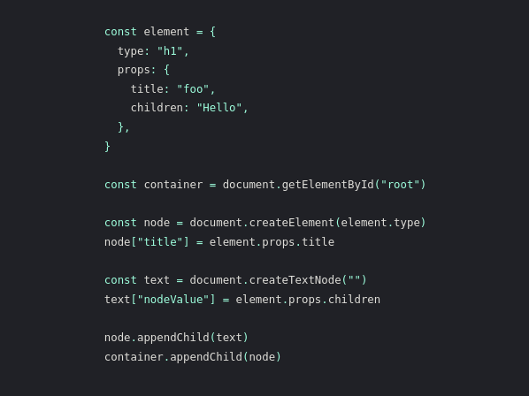

##Создай свой собственный React

Мы собираемся переписать React с нуля. Следуя архитектуре настоящего кода React, но без всех оптимизаций, и не нужных фич. Начиная с начала, мы добавим весь этот функционал, шаг за шагом:

    I: Функция createElement
    II: Функция render 
    III: Параллельный режим
    IV: Fibers
    V: Визуализация и фиксация фаз
    VI: Reconciliation
    VII: Функциональные компоненты
    VIII: Хуки

###Шаг 0: Обзор

Давайте сначала разберем некоторые базовые понятия. Вы можете пропустить этот шаг, если уже хорошо понимаете как работают  React, JSX и DOM.

Мы будем использовать это React приложение, всего три строки кода. На первой мы определяем React элемент, на следующей получаем ноду из DOM, а на последней рендерим React элемент в контейнер.

Давайте удалим весь специфический React код, и заменим его ванильным JavaScript.

На первой строке в переменную element мы записываем JSX. JSX трансформируется в JS с помощью таких инструментов как Babel. Трансформация довольно проста. Заменяем код тега, на вызов функции createElement передавая название тега, пропсы и дочерний элемент children в виде параметров.

React.createElement создает объект из этих параметров. За исключением некоторых валидаций - это все, что она делает. По-этому мы безопасно можем заменить вызов этой функции, на результат ее выполнения.

И вот что из себя представляет element - это объект с двумя свойствами type и props (на самом деле [их больше](https://github.com/facebook/react/blob/f4cc45ce962adc9f307690e1d5cfa28a288418eb/packages/react/src/ReactElement.js#L111), но нас заботят только эти два). type - строка, которая указывает на тип DOM элемента, который мы хотим создать. Это tagName, который мы передаем в document.createElement, когда хотим создать HTML элемент. Тут так же может быть и функция, но мы оставим это для шага 7.

props - это еще один объект, который содержит ключи и значения из JSX атрибутов. Также тут присутствует специальное свойство children. В нашем случае children - строка, но обычно это массив с множеством элементов. Вот почему элементы также являются деревьями.

Другой кусок кода, который нам необходимо заменить - вызов ReactDOM.render. render - это то место, с которого React начинает изменять DOM, давайте самостоятельно реализуем этот метод.

В первую очередь мы создаем DOM-ноду, используя поле type элемента, в нашем случае - это h1. Далее мы назначаем все пропы элемента этой ноде. В данном примере только title. Чтобы избежать путаницы, я буду использовать термин “элемент” для обозначения react-элемента, а термин “нода” для обозначения DOM-элемента.

Далее мы создаем ноды для поля children. Так как в children у нас всего лишь строка, создаем текстовую ноду. Использование textNode вместо установки innerText позволит нам позже обрабатывать все элементы одинаково. Обратите также внимание на то, как мы устанавливаем nodeValue, как мы делали это с заголовком h1.

В конце концов мы добавляем текстовую ноду в h1, а h1 в container. И теперь мы имеем точно такое же приложение, как и раньше, но без использования реакта.

