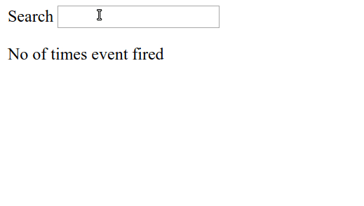
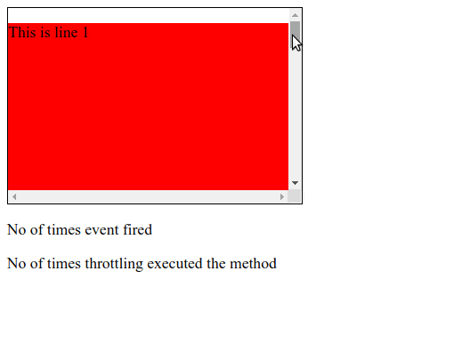

В этой статье мы обсудим техники debouncing и throttling, использование которых не только увеличит производительность вашего сайта, но также поможет предотвратить лишние вызовы API и уменьшить нагрузку на сервер.
Техники debouncing и throttling используются для ограничения количества вызовов функций. Обычно, когда и как много раз вызывается функция, решает разработчик. Но в некоторых случаях, разработчик дает эту возможность пользователю. Теперь пользователь должен решать, когда и сколько раз вызывать функцию.

Например функция, привязанная к событию элемента button “click”, ”mousemove” или к window “resize”, позволяет решать пользователю когда ее вызывать, и как много раз. В такие моменты пользователь может выполнять эти действия гораздо чаще, чем следовало бы. Это может плохо сказаться на производительности сайта, особенно если функция привязанная к этому событию выполняет какие-то сложные вычисления. В таких случаях, где пользователь имеет контроль над выполнением функции, разработчики должны были спроектировать некоторые техники для ограничения количества вызовов функции пользователем.

Давайте рассмотрим на примере элемента input. Каждый раз, когда вы что-то вводите в поле - происходит вызов API для получения данных с сервера на основе тех букв, что вы ввели.

Для простоты мы не передали параметр (то есть слово, введенное пользователем в строке поиска) в функцию makeAPICall.



_`searchbar.html`_

```html
<html>
    <body>
        <label>Search</label>
        <!-- Renders an HTML input box -->
        <input  type="text" id="search-box" />
        
        <p>№ of times event fired</p>
        <p id='show-api-call-count'></p>
    </body>
    
    <script src="issueWithoutDebounceThrottling.js"></script>
</html>
```

_`issueWithoutDebounceThrottling.js`_
```javascript
var  searchBoxDom  =  document.getElementById('search-box');

function  makeAPICall() {
	// This represents a very heavy metho which takes a lot of time to execute
}

// Add "input" event listener on the text box or search bar
searchBoxDom.addEventListener('input', function () {
	var  showApiCallCountDom  =  document.getElementById('show-api-call-count');
	var  apiCallCount  =  showApiCallCountDom.innerHTML  ||  0;
	
	// A very heavy method which takes a lot of time to execute
	makeAPICall()
	
	apiCallCount  =  parseInt(apiCallCount) +  1;
	// Updates the number of times makeAPICall method is called
	showApiCallCountDom.innerHTML  =  apiCallCount;
})

```

Приведенный выше код отображает HTML-страницу с текстовым полем. В текстовое поле мы добавили обработчик события oninput, который вызывает анонимную функцию. Анонимная функция вызывается каждый раз, когда пользователь вводит текст в поле.

Анонимная функция отображает количество вызванных oninput событий пользователем, пока он печатал. Внутри нее мы вызываем функцию makeApiCall, которая выполняет какое-то сложное вычисление, например делает запрос к API за получением информации из базы данных. Этот запрос займет какое-то время, а затем вернет ответ.

Предположим, что функция makeAPICall занимает 500 миллисекунд для получения данных от API. Теперь, если пользователь будет печатать 1 букву каждые 100 миллисекунд, тогда функция makeAPICall будет вызвана 5 раз за 500 миллисекунд. Таким образом, еще до того, как makeAPICall выполнил свою задачу и вернул ответ, мы делаем еще 4 вызова API, что добавит дополнительную нагрузку на сервер.

Кроме того, эти запросы к API излишни. Мы могли бы получить нужные данные всего за один вызов API после того, как пользователь завершил набор текста. Но как мы можем понять, завершил ли пользователь печатать?  В этой ситуации мы можем предположить, что если пользователь не печатает в течении 200 миллисекунд - он перестал печатать. В итоге мы ограничим количество вызовов функции makeAPICall.

Эта техника ограничения количества вызовов функций в обработчике события называется debouncing и throttling. Debouncing и throttling также предотвращает  большую нагрузку на сервер путем вызова API.

Давайте попробуем разобрать оба этих термина с помощью примеров из реальной жизни.

### Throttling
Представь себя 7-летним малышом, который любит шоколадный торт! Сегодня твоя мама сделала один, но это не для тебя, это для гостей! Ты, будучи настойчивым, продолжаешь просить у нее торт. Наконец, она дает тебе торт. Но ты продолжаешь просить у нее больше. Раздраженная, она соглашается дать тебе больше торта с условием, что ты можешь получить следующий кусочек только через час. Тем не менее, ты продолжаешь просить у нее торт, но теперь она игнорирует тебя. Наконец, через один час ты получаешь больше торта. Если ты попросишь еще, то получишь его только через час, независимо от того, сколько раз будешь просить.

Вот, что такое throttling!

> Throttling - это метод, при котором, независимо от того, сколько раз пользователь вызвал событие, функция-обработчик этого события будет вызвана только один раз в заданное время.

Например, когда пользователь нажимает на кнопку, вызывается функция helloWorld, которая выводит в консоль надпись “Hello World!”. Теперь, когда мы добавим throttling с интервалом в 1000 миллисекунд в функцию helloWorld, не будет иметь значения количество кликов по кнопке, Hello, world будет выведен только один раз в 1000 миллисекунд. Throttling гарантирует, что функция будет вызываться с регулярным интервалом.

### Debouncing
Рассмотрим тот же пример торта. На этот раз вы продолжали так много раз просить у мамы пирог, что она раздражалась и говорила, что даст вам пирог, только если вы помолчите один час. Это означает, что вы не получите торт, если будете продолжать спрашивать ее постоянно - вы получите его только через час после последнего запроса, как только перестанете просить торт. 

Это и есть debouncing

> С debouncing независимо от того, сколько раз пользователь запускает событие, функция-обработчик будет выполняться только по истечении указанного времени, как только пользователь прекратит вызывать событие.

Например, предположим, что пользователь нажимает кнопку 5 раз за 100 миллисекунд. debouncing не позволит ни одному из этих кликов выполнить функцию-обработчик. Как только пользователь перестал щелкать, если установленное время составляет 100 миллисекунд, функция-обработчик будет выполнена через 100 миллисекунд. Таким образом, невооруженным глазом debouncing ведет себя как группировка нескольких событий в одно событие.

### Когда использовать?

Debouncing и throttling рекомендуется использовать для событий, которые пользователь может запускать чаще, чем вам нужно.

Например изменение размера окна и прокрутка страница. Основное различие между throttling и debouncing заключается в том, что throttling выполняет функцию с регулярным интервалом, в то время как debouncing выполняет функцию только после некоторого периода.

Debouncing и throttling не являются чем-то, что предоставляется самим JavaScript. Это просто концепции, которые мы можем реализовать с помощью web API setTimeout. Некоторые библиотеки, такие как underscore.js и loadash, предоставляют эти методы из коробки.

Как throttling, так и debouncing могут быть реализованы с помощью функции setTimeout. Итак, давайте попробуем понять функцию setTimeout.

### setTimeout

setTimeout - это функция планирования в JavaScript, которую можно использовать для планирования выполнения любой функции. Это web API, предоставляемый браузерами и используемый для выполнения функции по истечении заданного времени. Вот основной синтаксис:

```javascript
var timerId = setTimeout(callbackFunction, timeToDelay)
```

Функция setTimeout принимает входные данные как callbackFunction, которая является функцией, которая будет выполнена после истечения таймера, а timeToDelay - это время в миллисекундах, после которого будет выполняться callbackFunction.

Функция setTimeout возвращает timerId, который является положительным целочисленным значением, чтобы однозначно идентифицировать таймер, созданный при вызове setTimeout; это значение может быть передано в clearTimeout для отмены тайм-аута.

Пример

```javascript
function delayFuncExec() {
	console.log("I will be called after 100 milliseconds");
}

var timerId = setTimeout(delayFuncExec, 100)

console.log("Timer Id: " + timerId)
```
Здесь delayFuncExec будет выполняться через 100  миллисекунд. timerId будет хранить целое число, возвращаемое функцией setTimeout

### clearTimeout

Функция clearTimeout используется для отмены ранее установленного времени ожидания путем вызова функции setTimeout. clearTimeout принимает значение timerId, возвращаемое функцией setTimeout, в качестве ввода и отменяет его выполнение. Итак, если вы хотите отменить выполнение любой функции setTimeout, вы можете использовать функцию clearTimeout, чтобы отменить ее, передав ее timerId.

Пример

```javascript
function delayFuncExec() {
	// Эта строка не будет напечатана, так как выполнение функции будет отменено.
	console.log("I will not be executed as I will be cancelled");
}

var timerId = setTimeout(delayFuncExec, 100)
console.log("Timer Id: " + timerId)

clearInterval(timerId)
```

Теперь давайте попробуем реализовать throttling и debouncing используя JavaScript.

### Реализация Throttling на JavaScript

Throttling изменит функцию таким образом, чтобы ее можно было запускать максимум один раз за промежуток времени. Например, throttling будет выполнять функцию только один раз в 1000 миллисекунд, независимо от того, сколько раз пользователь нажимает кнопку.



На изображении выше мы видим, что когда пользователь выполняет прокрутку, количество событий прокрутки намного больше, чем количество выполнений функции, обернутой в throttling. Кроме того, throttling выполнял функцию через равные промежутки времени, независимо от того, сколько раз запускается событие прокрутки. Давайте попробуем написать код для throttling.

_`throttling.html`_
```html
<html>
	<style>
		div {
			border: 1px  solid  black;
			width: 300px;
			height: 200px;
			overflow: scroll;
		}
	</style>
	<body>
		<div  id="div-body">
			<p style="background-color: red; height: 700px">This is line 1</p>
			<p style="background-color: blue; height: 700px">This is line 2</p>
			<p style="background-color: green; height: 700px">This is line 3</p>
			<p style="background-color: yellow; height: 700px">This is line 4</p>
		</div>
		
		<p>No of times event fired</p>
		<p id='show-api-call-count'></p>

		<p>No of times throttling executed the method</p>
		<p id="debounc-count"></p>
	</body>
	
	<script  src="throttling.js">  </script>
</html>
```

_`throttling.js`_
```javascript
var  timerId;
var  divBodyDom  =  document.getElementById('div-body');

// This represents a very heavy method which takes a lot of time to execute
function  makeAPICall() {
	var  debounceDom  =  document.getElementById('debounc-count');
	var  debounceCount  =  debounceDom.innerHTML  ||  0;

	debounceDom.innerHTML  =  parseInt(debounceCount) +  1
}

// Throttle function: Input as function which needs to be throttled and delay is the time interval in milliseconds
var  throttleFunction  =  function (func, delay) {
	// If setTimeout is already scheduled, no need to do anything
	if (timerId) {
		return
	}

	// Schedule a setTimeout after delay seconds
	timerId  =  setTimeout(function () {
		func()
		
		// Once setTimeout function execution is finished, timerId = undefined so that in <br>
		// the next scroll event function execution can be scheduled by the setTimeout
		timerId  =  undefined;
	}, delay)
}

// Event listener on the input box
divBodyDom.addEventListener('scroll', function () {
	var  apiCallCountDom  =  document.getElementById('show-api-call-count');
	var  apiCallCount  =  apiCallCountDom.innerHTML  ||  0;
	apiCallCount  =  parseInt(apiCallCount) +  1;

	// Updates the number of times makeAPICall method is called
	apiCallCountDom.innerHTML  =  apiCallCount;

	// Throttles makeAPICall method such that it is called once in every 200 milliseconds
	throttleFunction(makeAPICall, 200)
})
```

Приведенный выше код отображает div с полосой прокрутки. Мы добавили обработчик на событие прокрутки. Каждый раз, когда пользователь выполняет прокрутку, вызывается анонимная функция, которая печатает количество срабатываний события прокрутки. Когда пользователь прокручивает, мы хотим выполнить метод makeAPICall. Но, поскольку этот метод тяжелый, его непосредственное присоединение к событию прокрутки приведет к его частому срабатыванию. Это может вызвать ненужную нагрузку на сервер. Чтобы предотвратить это, мы использовали технику throttling.

Давайте рассмотрим приведенный выше код по шагам:

1. Когда запускается первое событие прокрутки, вызывается throttleFunction с функцией makeAPICall и задержкой в ​​миллисекундах в качестве параметров.
2. В throttleFunction timerId не определен, так как он еще не был инициализирован. Итак, мы продолжим и запланируем функцию, которая является функцией APICall, используя функцию setTimeout. Функция setTimeout выполнит функцию func или функцию makeAPICall через 200 миллисекунд. Теперь timerId будет иметь уникальный идентификатор этой функции setTimeout.
3. Когда запускается второе событие для прокрутки, timerId не является неопределенным внутри throttleFunction, поэтому функция завершиться без планирования выполнения makeAPICall. Если значение timerId не равно undefined, это означает, что функция setTimeout уже запланирована, поэтому нам не нужно планировать другую функцию.
4. Таким образом, до тех пор, пока setTimeout не выполнит функцию makeAPICall, мы не сможем запланировать другую функцию makeAPICall, используя setTimeout. Это гарантирует, что функция makeAPICall будет вызываться только один раз за интервал.
5. Следует отметить следующее: внутри функции setTimeout мы изменили timerId на undefined, поэтому, как только запланированная функция makeAPICall будет выполнена, и пользователь снова выполнит прокрутку, throttleFunction запланирует выполнение функции makeAPICall с помощью setTimeout снова. Таким образом, функция makeAPICall будет выполняться только один раз за заданный интервал.

### Реализация Debouncing на JavaScript


На изображении выше мы можем видеть, что, когда пользователь печатает, количество событий oninput, инициируемых намного больше, чем количество раз, когда debounce выполнял функцию. Кроме того, функция debounce выполняет функцию только после того, как пользователь перестал вводить текст в строке поиска. 

Давайте попробуем написать код для debouncing

_`debounce.html`_
```html
<html>
	<body>
		<label>Search</label>
		<!-- Renders an HTML input box -->
		<input  type="text"  id="search-box">

		<p>No of times event fired</p>
		<p  id='show-api-call-count'></p>

		<p>No of times debounce executed the method</p>
		<p  id="debounce-count"></p>
	</body>
	<script  src="debounce.js"></script>
</html>
```

_`debounce.js`_
```javascript
var  timerId;
var  searchBoxDom  =  document.getElementById('search-box');

// This represents a very heavy method. Which takes a lot of time to execute
function  makeAPICall() {
	var  debounceDom  =  document.getElementById('debounce-count');
	var  debounceCount  =  debounceDom.innerHTML  ||  0;
	
	debounceDom.innerHTML  =  parseInt(debounceCount) +  1
}

// Debounce function: Input as function which needs to be debounced and delay is the debounced time in milliseconds
var  debounceFunction  =  function (func, delay) {
	// Cancels the setTimeout method execution
	clearTimeout(timerId)

	// Executes the func after delay time.
	timerId  =  setTimeout(func, delay)
}

// Event listener on the input box
searchBoxDom.addEventListener('input', function () {
	var  apiCallCountDom  =  document.getElementById('show-api-call-count');
	var  apiCallCount  =  apiCallCountDom.innerHTML  ||  0;
	apiCallCount  =  parseInt(apiCallCount) +  1;

	// Updates the number of times makeAPICall method is called
	apiCallCountDom.innerHTML  =  apiCallCount;

	// Debounces makeAPICall method
	debounceFunction(makeAPICall, 200)
})
```

Приведенный выше код отображает HTML-страницу с текстовым полем. Мы повесили обработчик события oninput на поле ввода, которое запускается каждый раз, когда пользователь что-то вводит.

Когда пользователь что-то печатает, мы хотим вызвать метод makeAPICall, который выполняет вызов API для извлечения данных. Но, поскольку этот метод тяжелый, мы не хотим вызывать его каждый раз, когда пользователь вводит что-то в текстовое поле. Поэтому вместо того, чтобы вызывать его непосредственно внутри анонимной функции, мы вызвали функцию debounceFunction, внутри которой вызывается метод makeAPICall.

Давайте разберемся лучше с функцией debounceFunction:

Функция debounceFunction используется для ограничения количества выполнений любой функции. Она принимает в параметры функцию, выполнение которой должно быть ограничено, и задержкой, которая является временем в миллисекундах. Если пользователь печатает очень быстро, функция debounceFunction разрешит выполнение func только тогда, когда пользователь перестал печатать в текстовом поле.

Рассмотрим приведенный выше код по шагам:

1. Когда пользователь вводит первую букву в текстовом поле, обработчик событий или анонимная функция вызывает функцию debounceFunction с функцией makeAPICall и вторым параметром - 200 миллисекунд.
2. Внутри функции debounceFunction timerId не определен, поскольку он еще не был инициализирован. Следовательно, функция clearTimeout ничего не будет делать.
3. Далее мы передаем func, который является функцией makeAPICall, в качестве обратного вызова функции setTimeout с задержкой, равной 200 миллисекундам, в качестве другого параметра. Это означает, что мы хотим, чтобы функция makeAPICall выполнялась через 200 миллисекунд. Функция setTimeout возвращает целочисленное значение в качестве уникального идентификатора, который сохраняется в timerId.
4. Теперь, когда пользователь печатает вторую букву в текстовом поле, снова вызывается функция debounceFunction. Но на этот раз timerId не является неопределенным, и в нем хранится уникальный идентификатор предыдущей функции setTimeout. Следовательно, когда функция clearTimeout вызывается с этим timerId, она отменяет выполнение предыдущей функции setTimeout.
5. Теперь, все функции func или makeAPICall, запланированные функцией setTimeout из-за того, что пользователь вводит текст в поле, будут отменены функцией clearTimeout. Только функция makeAPICall, запланированная последней буквой в текстовом поле, будет выполнена после указанного времени 200 миллисекунд.

Таким образом, независимо от того, сколько букв пользователь вводит в текстовое поле, функция debounceFunction выполнит метод makeAPICall только один раз через 200 миллисекунд - после того, как пользователь введет последнюю букву. Это и есть debouncing!

### Использование Debouncing и Throttling в реальной жизни

1. Мы можем ограничить событие нажатия кнопки, если не хотим, чтобы пользователь спамил, часто нажимая кнопку с помощью throttling.
2. В случае события изменения размера окна, если мы хотим перерисовать пользовательский интерфейс только тогда, когда пользователь установил размер окна, мы можем использовать debouncing.
3. В случае перемещения мыши, если мы отображаем координаты местоположения указателя мыши, гораздо лучше показывать координаты, как только пользователь достиг желаемого местоположения. Здесь мы можем использовать debouncing.

### Вывод

В этой статье мы поняли концепции debouncing и throttling  наряду с их использованием в реальном мире. Мы также реализовали обе концепции, используя HTML и JavaScript.

[Статья автора Rupesh Mishra в оригинале](https://www.telerik.com/blogs/debouncing-and-throttling-in-javascript).

