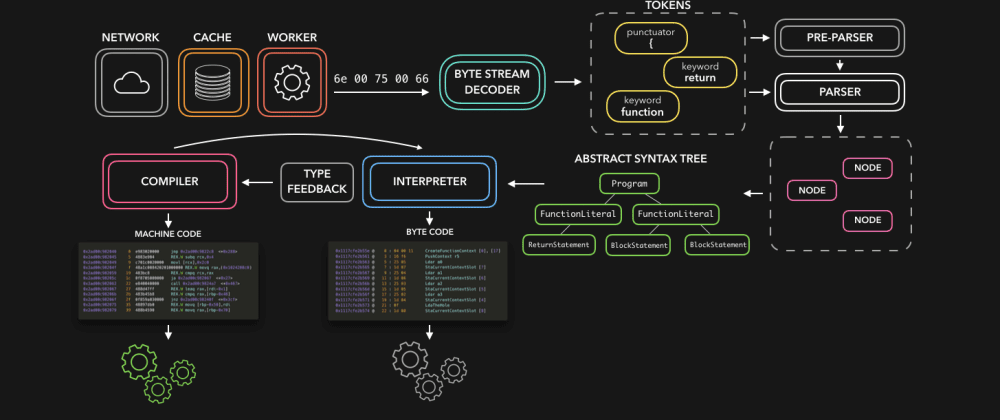
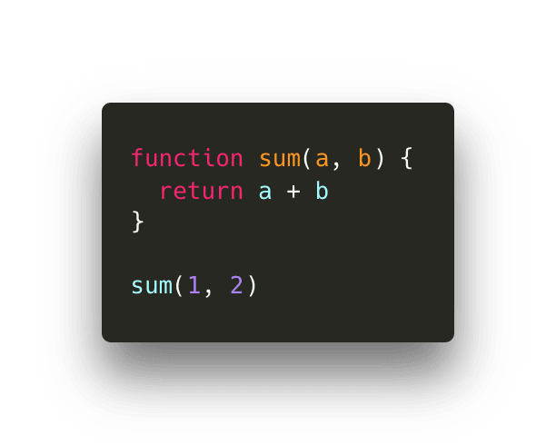
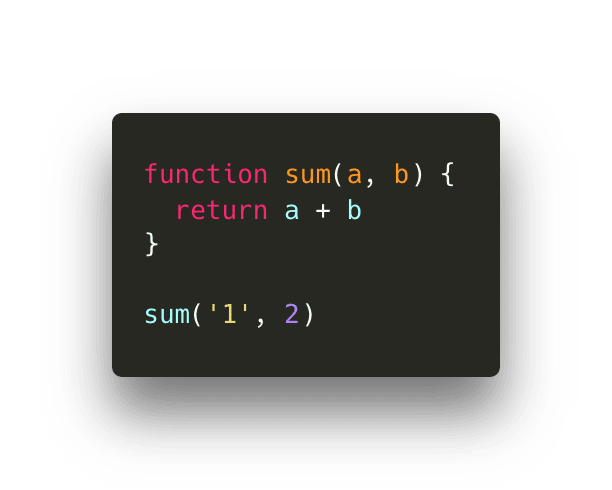

Javascript - это классно! Но как вообще машины могут понимать код, который вы написали? Как js разработчики, мы обычно не имеем дело с компиляторами. Тем не менее, определенно полезно знать базовые принципы работы javascript движка, и понимать как он обрабатывает наш, понятный человеку js код, и превращает его в что-то понятное машине.

> Заметка: эта статья главным образом основана на работе движка V8, который используется в Node.js и Chromium-браузерах.

HTML-парсер натыкается на тег script с атрибутом src. Код из указанного в src источника загружается с сети, кеша или установленного сервис воркера. В ответ приходит запрашиваемый скрипт в виде потока байтов, о котором позаботится декодер потока байтов. Он декодирует поток по мере его загрузки.

Декодер потока байтов создает создает символы из расшифрованного потока. Например, 0066 декодируется в f, 0075 в u, 006e в n, 0063 в c,0074 в t, 0069 в i, 006f в o, и 006e в n за которым следует пробел. Это зарезервированное ключевое слово в JavaScript, оно создается и отправляется парсеру (и пре-парсеру, который я не показала в gif-ках, но объясню позже). То же самое происходит с остальным потоком байтов.

Движок использует два парсера: пре-парсер и парсер. Пре-парсер только проверяет слова, ранее созданные из символов (далее токены), на наличие синтаксических ошибок ❌. Этот процесс может уменьшить количество ошибок, которые в дальнейшем обнаружит парсер. Если ошибки не будут обнаружены, парсер создаст ноду, основанную на токене полученном из декодера потока байтов. Ноды образуют Абстрактное Синтаксическое Дерево (Abstract Syntax Tree,  далее AST)

И тут наступает время интерпретатора. Он проходит через AST и генерирует байт код, основанный на информации, которую содержит AST. Как только байт код будет полностью сгенерирован - AST удалится, очистив память. В итоге у нас появится кое-что, с чем машина может работать!

Хоть байт-код и быстрый, он может быть еще быстрее. Когда байт-код выполняется, информация генерируется, и может обнаружится часто повторяющееся поведение. Возможно вы запустили функцию много раз - это значит, время оптимизировать! 

Байт-код вместе с сгенерированными возвращаемыми типами данных отправляется оптимизирующему компилятору. Оптимизирующий компилятор принимает байт-код и возвращаемые типы  и генерирует из них высокооптимизированный машинный код.

Javascript - динамически типизированный язык, это означает, что типы данных могут меняться постоянно. Он выполнялся бы безумно медленно, если бы javascript-движок должен был проверять каждый раз тип данных конкретного значения.

Чтобы сократить время, необходимое для интерпретации кода, оптимизированный машинный код обрабатывает только те случаи, которые движок видел раньше во время выполнения байт-кода.
Если мы неоднократно используем определенный кусок кода, который возвращает данные одного и того же типа опять и опять, оптимизированный машинный код можно просто повторно использовать, чтобы ускорить процесс.
Однако, поскольку JavaScript динамически типизирован, может случиться так, что один и тот же фрагмент кода внезапно вернет данные другого типа. Если это происходит, машинный код де-оптимизируется, и механизм возвращается к интерпретации сгенерированного байтового кода.

Скажем, определенная функция вызывается 100 раз и всегда возвращает одно и то же значение. Предполагается, что она также вернет это значение в 101-й раз, когда вы ее вызовете.

Допустим, у нас есть следующая функция sum, которая (до сих пор) всегда вызывалась с числовыми значениями в качестве аргументов каждый раз:

Эта функция вернет 3! В следующий раз, когда мы вызовем ее, движок будет предполагать, что мы вызовем ее снова с двумя числовыми значениями.

Если это так, динамический поиск не требуется, и движок может просто повторно использовать оптимизированный машинный код. Иначе, если предположение было неверным, он вернется к исходному байтовому коду вместо оптимизированного машинного кода.

Например, при следующем вызове мы передаем строку вместо числа. Так как JavaScript динамически типизирован, мы можем сделать это без каких-либо ошибок!

Это означает, что число 2 будет приведено в строку, а функция вернет строку «12». Движок возвращается к выполнению интерпретированного байт-кода и обновляет возвращаемый тип.

Надеюсь этот пост был вам полезен! 😊 Конечно, в движке есть много частей, которые я не рассмотрел в этой статье (JS heap, call stack, и т. д.), О которых я мог бы рассказать позже! Я определенно призываю вас начать некоторые исследования самостоятельно, если вы интересуетесь внутренностями JavaScript, V8 имеет открытый исходный код и имеет отличную документацию о том, как он работает под капотом! 

[Статья автора Lydia Hallie в оригинале](https://dev.to/lydiahallie/javascript-visualized-the-javascript-engine-4cdf).
